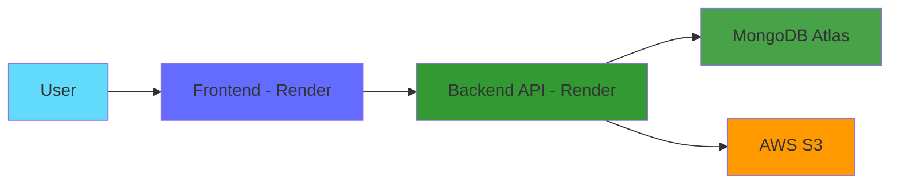
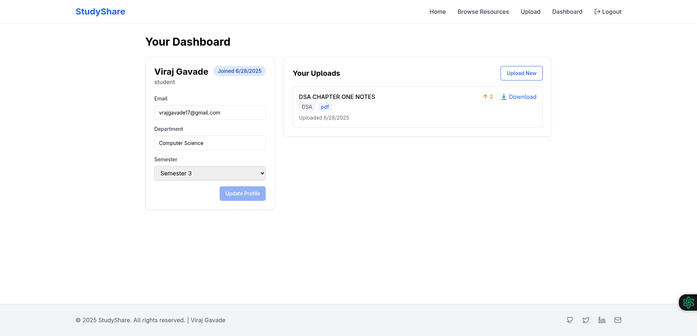
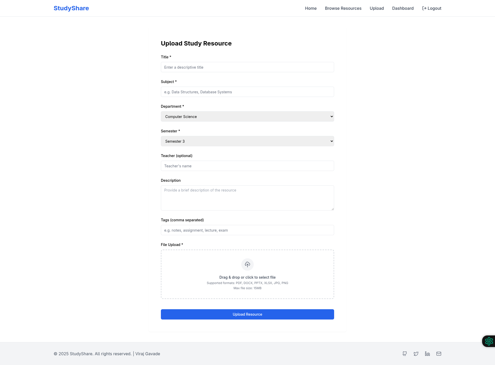
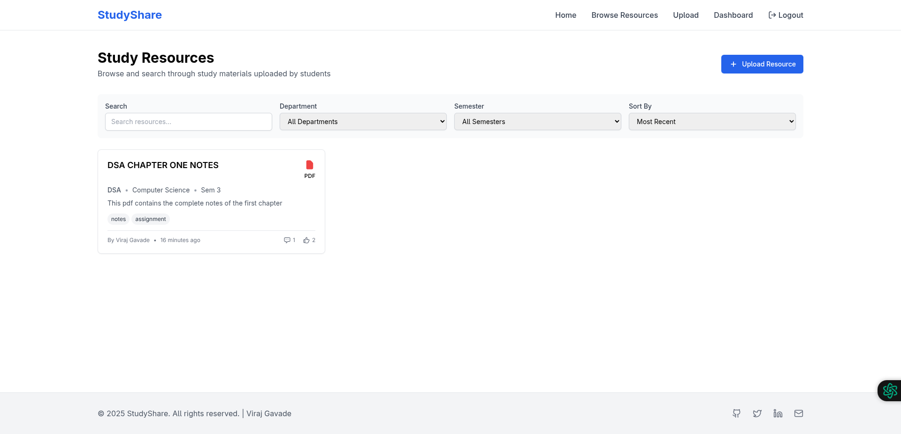
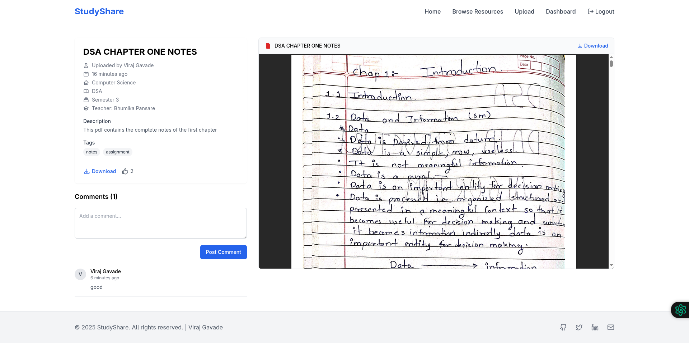

# 📚 StudyShare

<div align="center">

**A Modern Platform for Academic Resource Sharing**

[](https://opensource.org/licenses/MIT)
[](https://www.typescriptlang.org/)
[](https://reactjs.org/)
[](https://nodejs.org/)
[](https://www.mongodb.com/)
[](https://aws.amazon.com/s3/)

[🌐 Live Demo](https://study-share-frontend.onrender.com) • [📖 Documentation](#-api-documentation) • [🐛 Report Bug](https://github.com/yourusername/study-share/issues) • [✨ Request Feature](https://github.com/yourusername/study-share/issues)

</div>

---

## 📋 Table of Contents

- [Overview](#-overview)
- [Key Features](#-key-features)
- [Tech Stack](#-tech-stack)
- [Live Deployment](#-live-deployment)
- [Getting Started](#-getting-started)
- [API Documentation](#-api-documentation)
- [Project Structure](#-project-structure)
- [Screenshots](#-screenshots)
- [Contributing](#-contributing)
- [License](#-license)

---

## 🎯 Overview

StudyShare is a comprehensive full-stack web application designed to revolutionize how students share and discover academic resources. Built with the MERN stack and powered by AWS S3, it provides a secure, scalable, and user-friendly platform for educational content collaboration.

### 🌟 Why StudyShare?

- **📤 Seamless Sharing**: Upload and organize study materials with rich metadata
- **🔍 Smart Discovery**: Advanced search and filtering to find exactly what you need
- **👥 Community Driven**: Upvote, comment, and engage with educational content
- **🔒 Secure & Reliable**: JWT authentication and AWS S3 for enterprise-grade security
- **⚡ Lightning Fast**: Built with modern tech stack for optimal performance

---

## ✨ Key Features

### 🔐 **Authentication & Security**
- ✅ Secure user registration with email verification
- ✅ JWT-based authentication system
- ✅ Password reset via email with secure tokens
- ✅ Protected routes and role-based access control

### 📁 **Resource Management**
- ✅ Multi-format file uploads (PDF, DOCX, PPTX, images)
- ✅ Rich metadata tagging (subject, department, semester)
- ✅ Intelligent categorization system
- ✅ Full CRUD operations on resources
- ✅ Cloud storage with AWS S3 integration

### 🔎 **Advanced Search & Discovery**
- ✅ Full-text search across resources
- ✅ Filter by department, semester, and file type
- ✅ Sort by recency, popularity, or engagement
- ✅ Tag-based discovery system

### 👥 **Social Engagement**
- ✅ Upvote system to highlight quality content
- ✅ Threaded comment discussions
- ✅ User profiles and contribution tracking
- ✅ Activity dashboard

### 📊 **User Dashboard**
- ✅ Personal profile management
- ✅ Upload history and analytics
- ✅ Favorite resources collection
- ✅ Activity timeline

---

## 🛠️ Tech Stack

<table>
<tr>
<td width="50%" valign="top">

### **Backend**

| Technology | Purpose |
|------------|---------|
|  | Runtime environment |
|  | Web framework |
|  | Type safety |
|  | Database |
|  | ODM |
|  | Authentication |
|  | File storage |

</td>
<td width="50%" valign="top">

### **Frontend**

| Technology | Purpose |
|------------|---------|
|  | UI library |
|  | Type safety |
|  | Build tool |
|  | Styling |
|  | Routing |
|  | HTTP client |
|  | Animations |

</td>
</tr>
</table>

---

## 🌐 Live Deployment

StudyShare is deployed on **Render** using a microservices architecture:

| Service | URL | Status |
|---------|-----|--------|
| 🎨 **Frontend** | [study-share-frontend.onrender.com](https://study-share-frontend.onrender.com) |  |
| ⚙️ **Backend API** | [study-share-backend.onrender.com/api](https://study-share-backend.onrender.com/api) |  |

### 🏗️ Deployment Architecture

Despite being developed as a **monorepo**, the application is deployed as two independent services:



#### Frontend Service Configuration
```yaml
Build Command: npm install && npm run build
Publish Directory: dist
Environment Variables:
  VITE_API_URL: https://study-share-backend.onrender.com/api
```

#### Backend Service Configuration
```yaml
Build Command: npm install && npm run build
Start Command: node dist/server.js
Environment Variables:
  PORT: 10000
  MONGODB_URI: <mongodb_connection_string>
  JWT_SECRET: <jwt_secret>
  AWS_ACCESS_KEY_ID: <aws_key>
  AWS_SECRET_ACCESS_KEY: <aws_secret>
  AWS_REGION: <aws_region>
  S3_BUCKET_NAME: <bucket_name>
  FRONTEND_URL: https://study-share-frontend.onrender.com
```

### ⚠️ Known Issues

<details>
<summary><b>Express 5.x Path-to-RegExp Error</b></summary>

If you encounter this error:
```
TypeError: Missing parameter name at 1: https://git.new/pathToRegexpError
```

**Solution**: Ensure all routes follow Express 5.x path syntax. See the [Express 5 Migration Guide](https://expressjs.com/en/guide/migrating-5.html#path-syntax).
</details>

---

## 🚀 Getting Started

### 📋 Prerequisites

Before you begin, ensure you have the following installed:

- **Node.js** (v16 or higher) - [Download](https://nodejs.org/)
- **MongoDB** (local or Atlas) - [Setup Guide](https://www.mongodb.com/docs/manual/installation/)
- **AWS Account** with S3 access - [Create Account](https://aws.amazon.com/)
- **Git** - [Download](https://git-scm.com/)

### ⚡ Quick Start

#### 1️⃣ Clone the Repository

```bash
git clone https://github.com/yourusername/study-share.git
cd study-share
```

#### 2️⃣ Backend Setup

```bash
# Navigate to backend directory
cd Backend

# Install dependencies
npm install

# Create environment file
cp .env.example .env

# Configure your .env file (see configuration below)
nano .env

# Start development server
npm run dev
```

**Backend Environment Variables** (`.env`):

```env
# Server Configuration
PORT=5000
NODE_ENV=development

# Database
MONGODB_URI=mongodb://localhost:27017/studyshare
# Or for MongoDB Atlas:
# MONGODB_URI=mongodb+srv://<username>:<password>@cluster.mongodb.net/studyshare

# Frontend URL
FRONTEND_URL=http://localhost:5173

# JWT Configuration
JWT_SECRET=your-super-secret-jwt-key-here
JWT_EXPIRY=7d

# AWS S3 Configuration
AWS_ACCESS_KEY_ID=your-aws-access-key-id
AWS_SECRET_ACCESS_KEY=your-aws-secret-access-key
AWS_REGION=us-east-1
AWS_S3_BUCKET=your-s3-bucket-name

# Email Configuration (for password reset)
EMAIL_HOST=smtp.gmail.com
EMAIL_PORT=587
EMAIL_USER=your-email@gmail.com
EMAIL_PASS=your-app-specific-password
EMAIL_FROM=noreply@studyshare.com
```

#### 3️⃣ Frontend Setup

```bash
# Open a new terminal and navigate to frontend directory
cd Frontend

# Install dependencies
npm install

# Create environment file
cp .env.example .env

# Configure your .env file
nano .env

# Start development server
npm run dev
```

**Frontend Environment Variables** (`.env`):

```env
# API Configuration
VITE_API_URL=http://localhost:5000/api
VITE_APP_ENV=development

# For Production (Render deployment)
# VITE_API_URL=https://study-share-backend.onrender.com/api
# VITE_APP_ENV=production
```

#### 4️⃣ Access the Application

Open your browser and navigate to:
- **Frontend**: http://localhost:5173
- **Backend API**: http://localhost:5000/api

---

## ☁️ AWS S3 Configuration

### Setting Up Your S3 Bucket

1. **Create an S3 Bucket**
   - Login to [AWS Console](https://console.aws.amazon.com/)
   - Navigate to S3 service
   - Click "Create bucket"
   - Choose a unique bucket name
   - Select your preferred region
   - Uncheck "Block all public access" (we'll use bucket policy for security)

2. **Configure CORS Policy**

   Add this CORS configuration to your bucket:

   ```json
   [
     {
       "AllowedHeaders": ["*"],
       "AllowedMethods": ["GET", "PUT", "POST", "DELETE", "HEAD"],
       "AllowedOrigins": [
         "http://localhost:5173",
         "https://study-share-frontend.onrender.com"
       ],
       "ExposeHeaders": ["ETag"],
       "MaxAgeSeconds": 3000
     }
   ]
   ```

3. **Set Bucket Policy**

   ```json
   {
     "Version": "2012-10-17",
     "Statement": [
       {
         "Sid": "PublicReadGetObject",
         "Effect": "Allow",
         "Principal": "*",
         "Action": ["s3:GetObject"],
         "Resource": ["arn:aws:s3:::your-bucket-name/*"]
       }
     ]
   }
   ```

4. **Create IAM User**
   - Navigate to IAM service
   - Create a new user with programmatic access
   - Attach policy: `AmazonS3FullAccess`
   - Save the Access Key ID and Secret Access Key

---

## 📖 API Documentation

### Base URL
```
Development: http://localhost:5000/api
Production: https://study-share-backend.onrender.com/api
```

### 🔐 Authentication Endpoints

<details>
<summary><b>POST /auth/register</b> - Register a new user</summary>

**Request Body:**
```json
{
  "name": "John Doe",
  "email": "john@example.com",
  "password": "securePassword123",
  "department": "Computer Science",
  "semester": 3
}
```

**Response:**
```json
{
  "success": true,
  "message": "User registered successfully",
  "data": {
    "user": {
      "id": "user_id",
      "name": "John Doe",
      "email": "john@example.com"
    },
    "token": "jwt_token"
  }
}
```
</details>

<details>
<summary><b>POST /auth/login</b> - User login</summary>

**Request Body:**
```json
{
  "email": "john@example.com",
  "password": "securePassword123"
}
```

**Response:**
```json
{
  "success": true,
  "data": {
    "user": {
      "id": "user_id",
      "name": "John Doe",
      "email": "john@example.com"
    },
    "token": "jwt_token"
  }
}
```
</details>

<details>
<summary><b>POST /auth/forgot-password</b> - Request password reset</summary>

**Request Body:**
```json
{
  "email": "john@example.com"
}
```

**Response:**
```json
{
  "success": true,
  "message": "Password reset code sent to email"
}
```
</details>

### 📚 Resource Endpoints

<details>
<summary><b>POST /resources</b> - Upload a resource (🔒 Protected)</summary>

**Request:** Multipart form-data
```
file: [File]
title: "Introduction to Algorithms"
description: "Comprehensive guide to algorithms"
subject: "Data Structures"
department: "Computer Science"
semester: 3
tags: ["algorithms", "data structures", "tutorial"]
```

**Response:**
```json
{
  "success": true,
  "data": {
    "id": "resource_id",
    "title": "Introduction to Algorithms",
    "fileUrl": "https://s3.amazonaws.com/...",
    "uploadedBy": {
      "id": "user_id",
      "name": "John Doe"
    }
  }
}
```
</details>

<details>
<summary><b>GET /resources</b> - Get all resources</summary>

**Query Parameters:**
- `page`: Page number (default: 1)
- `limit`: Items per page (default: 10)
- `sort`: Sort by (recent, popular, comments)

**Response:**
```json
{
  "success": true,
  "data": {
    "resources": [...],
    "pagination": {
      "total": 100,
      "page": 1,
      "pages": 10
    }
  }
}
```
</details>

<details>
<summary><b>GET /resources/search</b> - Search resources</summary>

**Query Parameters:**
- `q`: Search query
- `department`: Filter by department
- `semester`: Filter by semester
- `fileType`: Filter by file type
- `tags`: Filter by tags (comma-separated)

**Response:**
```json
{
  "success": true,
  "data": {
    "resources": [...],
    "count": 25
  }
}
```
</details>

<details>
<summary><b>POST /resources/:id/upvote</b> - Upvote a resource (🔒 Protected)</summary>

**Response:**
```json
{
  "success": true,
  "data": {
    "upvoted": true,
    "upvoteCount": 42
  }
}
```
</details>

<details>
<summary><b>POST /resources/:id/comment</b> - Add a comment (🔒 Protected)</summary>

**Request Body:**
```json
{
  "text": "Great resource! Very helpful."
}
```

**Response:**
```json
{
  "success": true,
  "data": {
    "comment": {
      "id": "comment_id",
      "text": "Great resource! Very helpful.",
      "user": {
        "name": "John Doe"
      },
      "createdAt": "2025-01-30T10:00:00Z"
    }
  }
}
```
</details>

### 👤 User Endpoints

<details>
<summary><b>GET /users/me</b> - Get current user profile (🔒 Protected)</summary>

**Response:**
```json
{
  "success": true,
  "data": {
    "user": {
      "id": "user_id",
      "name": "John Doe",
      "email": "john@example.com",
      "department": "Computer Science",
      "semester": 3,
      "resourcesUploaded": 15,
      "createdAt": "2025-01-01T00:00:00Z"
    }
  }
}
```
</details>

---

## 📁 Project Structure

### Backend Structure
```
Backend/
├── src/
│   ├── app.ts                 # Express app configuration
│   ├── server.ts              # Application entry point
│   ├── config/
│   │   ├── aws.ts            # AWS S3 configuration
│   │   └── database.ts       # MongoDB connection
│   ├── controllers/
│   │   ├── auth.controller.ts
│   │   ├── resource.controller.ts
│   │   └── user.controller.ts
│   ├── models/
│   │   ├── User.ts           # User schema
│   │   ├── Resource.ts       # Resource schema
│   │   └── Comment.ts        # Comment schema
│   ├── routes/
│   │   ├── auth.routes.ts
│   │   ├── resource.routes.ts
│   │   └── user.routes.ts
│   ├── middlewares/
│   │   ├── auth.middleware.ts    # JWT verification
│   │   ├── upload.middleware.ts  # Multer S3 config
│   │   └── validation.middleware.ts
│   └── utils/
│       ├── jwt.ts            # JWT utilities
│       ├── email.ts          # Email service
│       └── validators.ts     # Input validators
├── package.json
└── tsconfig.json
```

### Frontend Structure
```
Frontend/
├── src/
│   ├── main.tsx              # Application entry
│   ├── App.tsx               # Root component
│   ├── components/
│   │   ├── ui/               # shadcn-ui components
│   │   ├── layout/
│   │   │   ├── Navbar.tsx
│   │   │   └── Footer.tsx
│   │   └── resources/
│   │       ├── ResourceCard.tsx
│   │       ├── ResourceList.tsx
│   │       └── UploadForm.tsx
│   ├── pages/
│   │   ├── Home.tsx
│   │   ├── Dashboard.tsx
│   │   ├── Resources.tsx
│   │   ├── ResourceDetail.tsx
│   │   ├── Upload.tsx
│   │   └── Auth/
│   │       ├── Login.tsx
│   │       └── Register.tsx
│   ├── context/
│   │   └── AuthContext.tsx   # Authentication state
│   ├── hooks/
│   │   ├── useAuth.ts
│   │   └── useResources.ts
│   ├── services/
│   │   ├── api.ts            # Axios instance
│   │   ├── auth.service.ts
│   │   └── resource.service.ts
│   └── utils/
│       ├── constants.ts
│       └── helpers.ts
├── package.json
├── vite.config.ts
└── tailwind.config.js
```

---

## 📸 Screenshots

<div align="center">

### 🏠 Home Page

*Clean, modern landing page with featured resources*

### 📊 User Dashboard

*Comprehensive dashboard with upload history and analytics*

### 📤 Upload Interface

*Intuitive file upload with rich metadata options*

### 🔍 Resources Listing

*Advanced search and filtering capabilities*

### 📄 Resource Details

*Detailed view with comments and engagement options*

</div>

---

## 🤝 Contributing

We welcome contributions from the community! Here's how you can help:

### How to Contribute

1. **Fork the repository**
   ```bash
   git clone https://github.com/yourusername/study-share.git
   ```

2. **Create a feature branch**
   ```bash
   git checkout -b feature/amazing-feature
   ```

3. **Make your changes**
   - Write clean, documented code
   - Follow existing code style
   - Add tests if applicable

4. **Commit your changes**
   ```bash
   git commit -m 'Add some amazing feature'
   ```

5. **Push to the branch**
   ```bash
   git push origin feature/amazing-feature
   ```

6. **Open a Pull Request**

### Development Guidelines

- Follow TypeScript best practices
- Use meaningful variable and function names
- Write comments for complex logic
- Ensure all tests pass before submitting PR
- Update documentation if needed

---

## 🐛 Bug Reports & Feature Requests

Found a bug or have a feature idea?

- **Bug Reports**: [Create an issue](https://github.com/yourusername/study-share/issues) with the "bug" label
- **Feature Requests**: [Create an issue](https://github.com/yourusername/study-share/issues) with the "enhancement" label

---

## 📝 License

This project is licensed under the MIT License - see below for details:

```
MIT License

Copyright (c) 2025 Viraj Gavade

Permission is hereby granted, free of charge, to any person obtaining a copy
of this software and associated documentation files (the "Software"), to deal
in the Software without restriction, including without limitation the rights
to use, copy, modify, merge, publish, distribute, sublicense, and/or sell
copies of the Software, and to permit persons to whom the Software is
furnished to do so, subject to the following conditions:

The above copyright notice and this permission notice shall be included in all
copies or substantial portions of the Software.

THE SOFTWARE IS PROVIDED "AS IS", WITHOUT WARRANTY OF ANY KIND, EXPRESS OR
IMPLIED, INCLUDING BUT NOT LIMITED TO THE WARRANTIES OF MERCHANTABILITY,
FITNESS FOR A PARTICULAR PURPOSE AND NONINFRINGEMENT. IN NO EVENT SHALL THE
AUTHORS OR COPYRIGHT HOLDERS BE LIABLE FOR ANY CLAIM, DAMAGES OR OTHER
LIABILITY, WHETHER IN AN ACTION OF CONTRACT, TORT OR OTHERWISE, ARISING FROM,
OUT OF OR IN CONNECTION WITH THE SOFTWARE OR THE USE OR OTHER DEALINGS IN THE
SOFTWARE.
```

---

## 👨‍💻 Author

**Viraj Gavade**

- GitHub: [@VirajGavade](https://github.com/yourusername)
- LinkedIn: [Viraj Gavade](https://linkedin.com/in/yourprofile)
- Email: your.email@example.com

---

## 🙏 Acknowledgments

- Thanks to all contributors who have helped shape this project
- Inspired by the need for better academic resource sharing
- Built with ❤️ for students, by students

---

<div align="center">

### ⭐ Star this repo if you find it helpful!

**Made with ❤️ and TypeScript**

[⬆ Back to Top](#-studyshare)

</div>
